# 在远程Ascend Docker容器中配置Cursor & Claude Code agent

本文实现下列目标：
- 让Agent能访问NPU device，自主完成「修改—编译—运行」的调试闭环
- 用Docker隔离Agent执行环境，避免误改其他文件
- 把复杂的CANN包依赖以及PyTorch、PTO、TileLang等框架各种打包到镜像
- 极简步骤，快速上手！

## 目录

- [前置：Ascend-Docker容器与 CANN 镜像](#prerequisite-docker-ascend-engine-and-cann-image)
  - [安装带昇腾runtime的Docker引擎](#install-docker-engine-with-ascend-runtime)
  - [把常用NPU依赖打包进Docker镜像](#build-docker-image-with-commonly-used-npu-dependencies)
  - [测试Container启动](#test-docker-container-launch)
  - [准备 Dev Container 配置文件](#prepare-dev-container-configuration)
- [在远程 Docker 中使用 Cursor Agent](#cursor-agent-in-remote-docker)
  - [步骤 1：安装Cursor 扩展插件](#step1-cursor-plug-ins)
  - [步骤 2：连接远程容器](#step2-remote-container-connection)
  - [步骤 3：在远程容器内执行命令](#step3-execute-commands-in-remote-container)
- [在远程 Docker 中使用 Claude Code](#claude-code-in-remote-docker)
  - [步骤 1：安装VS Code 扩展插件](#step1-vs-code-plug-ins)
  - [步骤 2：连接远程容器](#step2-remote-container-connection-1)
  - [步骤 3：启用 Claude Code 扩展](#step3-enable-claude-code-extension)

<a id="prerequisite-docker-ascend-engine-and-cann-image"></a>
## 前置：Ascend-Docker容器与 CANN 镜像

<a id="install-docker-engine-with-ascend-runtime"></a>
### 安装带昇腾runtime的Docker引擎

先按 [Docker官方文档](https://docs.docker.com/engine/install/ubuntu/) 在远程服务器上安装普通的Docker。

然后在标准 Docker 之上安装 [Ascend Docker Runtime](https://gitcode.com/Ascend/mind-cluster/tree/master/component/ascend-docker-runtime)。在 [Release 页面](https://gitcode.com/Ascend/mind-cluster/releases) 下载 `Ascend-docker-runtime*.run` 安装包文件。

记得配置 `sudo usermod -aG docker $USER`，这样之后运行 `docker run` 可以免去 `sudo`。

<a id="build-docker-image-with-commonly-used-npu-dependencies"></a>
### 把常用NPU依赖打包进Docker镜像

基础镜像建议使用官方维护的 [cann-container-image Dockerfile](https://github.com/Ascend/cann-container-image)。现成镜像见 [quay.io registry](https://quay.io/repository/ascend/cann?tab=tags)。

见完整的[.devcontainer/Dockerfile](.devcontainer/Dockerfile)。主要部分：

```dockerfile
FROM quay.io/ascend/cann:8.5.0-910b-ubuntu22.04-py3.11

RUN apt-get update && apt-get install -y \
    wget curl git vim \
    nodejs npm
# nodejs / npm 仅在为了安装 claude code CLI

# NPU运行pytorch
RUN pip install --no-cache-dir torch==2.9.0 --index-url https://download.pytorch.org/whl/cpu \
    && pip install --no-cache-dir torch-npu==2.9.0 \
    && pip install --no-cache-dir numpy pyyaml

# 额外Python包
RUN pip install --no-cache-dir \
    pytest pybind11 nanobind setuptools wheel \
    ipython jupyterlab matplotlib pandas

RUN npm install -g @anthropic-ai/claude-code
# 仅为了claude-code CLI；若用VS Code扩展则不必安装CLI

# 打包其他常用框架 ...
```

构建镜像：`docker build -t agent_npu_cann:8.5.0 .`

<a id="test-docker-container-launch"></a>
### 测试Container启动

对下面启动命令的几点说明：
- `$HOST_MOUNT_DIR` 把host目录mount到容器，Agent可对该目录下的文件与代码仓库进行**读写**
- Host上需要的NPU依赖（如 CANN driver）用 `:ro` 只读mount，使Agent**只能读、不能改**
- 若需限制 NPU 设备访问，可只传一部分的 `--device=/dev/davinci*`
- `ANTHROPIC_API_KEY` 仅在使用 Claude CLI 时需要；使用 Claude VS Code 扩展时不需要

```bash
HOST_MOUNT_DIR=$HOME/work_code/workdir_for_agent  # Agent仅能访问该目录

docker run --rm -it --ipc=host --privileged \
    --device=/dev/davinci0 --device=/dev/davinci1 \
    --device=/dev/davinci2 --device=/dev/davinci3 \
    --device=/dev/davinci4 --device=/dev/davinci5 \
    --device=/dev/davinci6 --device=/dev/davinci7 \
    --device=/dev/davinci_manager \
    --device=/dev/devmm_svm \
    --device=/dev/hisi_hdc \
    -v /usr/local/bin/npu-smi:/usr/local/bin/npu-smi:ro \
    -v /usr/local/Ascend/driver:/usr/local/Ascend/driver:ro \
    -v /etc/ascend_install.info:/etc/ascend_install.info:ro \
    -v $HOST_MOUNT_DIR:/workdir \
    -w /workdir \
    -e ANTHROPIC_API_KEY=$ANTHROPIC_API_KEY \
    agent_npu_cann:8.5.0 /bin/bash
```

<a id="prepare-dev-container-configuration"></a>
### 准备 Dev Container 配置文件

Cursor 与 VS Code 都需要一份 [Dev Container JSON](https://containers.dev/implementors/json_reference/)，把Code editor和container环境对接。

在远程服务器放置文件 `.devcontainer/devcontainer.json`：

```json
{
  "name": "agent_npu",
  "image": "agent_npu_cann:8.5.0",
  "workspaceFolder": "/workdir",
  "runArgs": [
    "--ipc=host",
    "--privileged",
    "--device=/dev/davinci0",
    "--device=/dev/davinci1",
    "--device=/dev/davinci2",
    "--device=/dev/davinci3",
    "--device=/dev/davinci4",
    "--device=/dev/davinci5",
    "--device=/dev/davinci6",
    "--device=/dev/davinci7",
    "--device=/dev/davinci_manager",
    "--device=/dev/devmm_svm",
    "--device=/dev/hisi_hdc"
  ],
  "mounts": [
    "type=bind,source=/usr/local/bin/npu-smi,target=/usr/local/bin/npu-smi,readonly",
    "type=bind,source=/usr/local/Ascend/driver,target=/usr/local/Ascend/driver,readonly",
    "type=bind,source=/etc/ascend_install.info,target=/etc/ascend_install.info,readonly",
    "type=bind,source=${localEnv:HOME}/work_code/workdir_for_agent,target=/workdir"
  ],
  "containerEnv": {
    "ANTHROPIC_API_KEY": "${localEnv:ANTHROPIC_API_KEY}"
  }
}
```

它与上一节的 `docker run` 命令等价。若要mount其他host目录，修改 `"mounts"` 中的 `workdir_for_agent`；需要其他环境变量就改 `"containerEnv"`；需要更少或更多设备就改 `"runArgs"`。

可以直接clone本仓，其中已包含 `Dockerfile` 与 `devcontainer.json`。

<a id="cursor-agent-in-remote-docker"></a>
## 在远程 Docker 中使用 Cursor Agent

<a id="step1-cursor-plug-ins"></a>
### 步骤 1：安装Cursor 扩展插件

安装 Anysphere 的 **Remote SSH** 扩展：

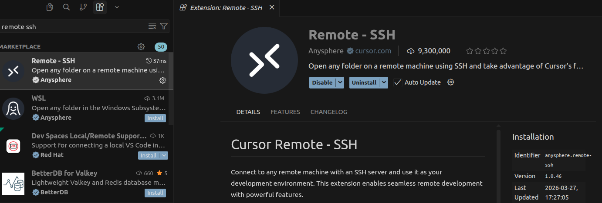

安装 Anysphere 的 **Dev Containers** 扩展：

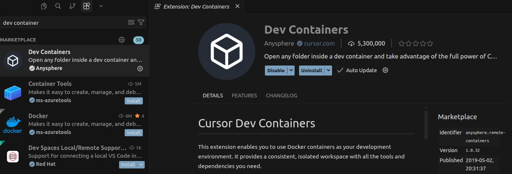

<a id="step2-remote-container-connection"></a>
### 步骤 2：连接远程容器

在命令面板（Command Palette）中搜索「Remote SSH」（快捷键与 VS Code 相同：`Ctrl + Shift + P`，Mac 上为 `Command + Shift + P`）。

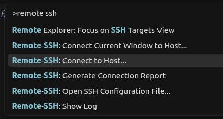

打开包含 `.devcontainer/devcontainer.json` 的文件夹时，一般会弹出提示 "Reopen in Container"。

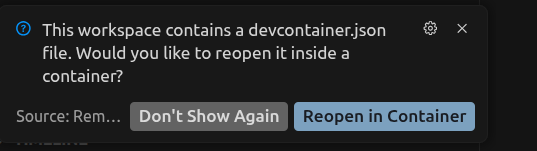

若未自动提示，可在命令面板（Command Palette）中搜索 **「Dev Containers: Reopen in Container」**（`Ctrl + Shift + P` / `Command + Shift + P`）。若修改过 Docker 镜像，请选择「Rebuild container」。

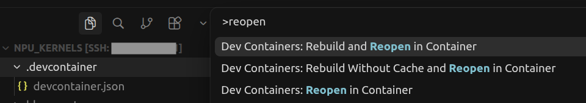

首次拉起 Docker instance可能需要数十秒。

<a id="step3-execute-commands-in-remote-container"></a>
### 步骤 3：在远程容器内执行命令

"Reopen in Container"完成后，Terminal 命令以及 **Agent 发起的命令**都会在远程 NPU Docker 环境中执行。

若未自动打开 bash Terminal，可搜索 **「Create New Terminal (With Profile)」**。

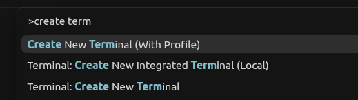

在 Cursor Terminal 中确认 torch-npu 可运行：

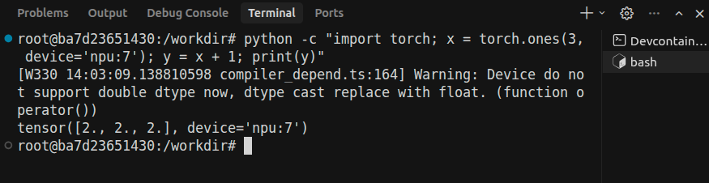

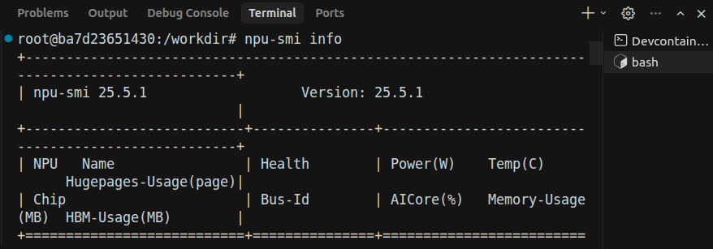

当Agent需要执行命令时，建议设为「Run Everything」，以便其能够编译运行NPU代码，自我闭环反馈。

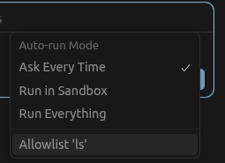

也可在设置界面中修改（**不在容器内时请勿使用如此宽松的权限**）：

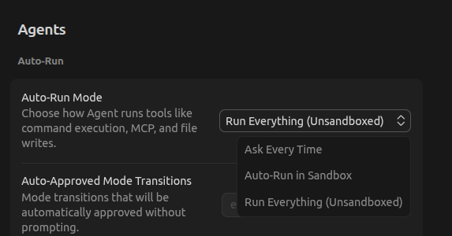

习惯小配置：提示词较长时，更希望用「Enter」换行而不是「Shift + Enter」：

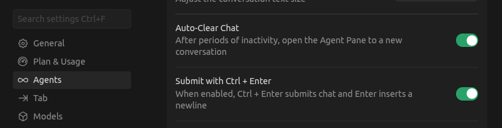

<a id="claude-code-in-remote-docker"></a>
## 在远程 Docker 中使用 Claude Code

Claude Code 的用法很多；本节只介绍与 Cursor 类似的、基于 [VS Code Claude 扩展](https://marketplace.visualstudio.com/items?itemName=anthropic.claude-code) 的流程。

<a id="step1-vs-code-plug-ins"></a>
### 步骤 1：安装VS Code 扩展插件

本地 VS Code 中安装官方 [Remote - SSH](https://marketplace.visualstudio.com/items?itemName=ms-vscode-remote.remote-ssh) 与 [Dev Containers](https://marketplace.visualstudio.com/items?itemName=ms-vscode-remote.remote-containers) 扩展。

<a id="step2-remote-container-connection-1"></a>
### 步骤 2：连接远程容器

通过「Remote SSH: Connect to Host」连接远程服务器（在命令面板（Command Palette）中操作）。

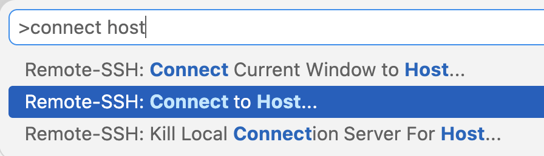

在远程 VS Code 窗口中打开包含 `.devcontainer/` 目录（其中有 `devcontainer.json`）的文件夹。也可clone本仓库到服务器并在 VS Code 中远程打开；随后会提示 **Reopen in Container**。

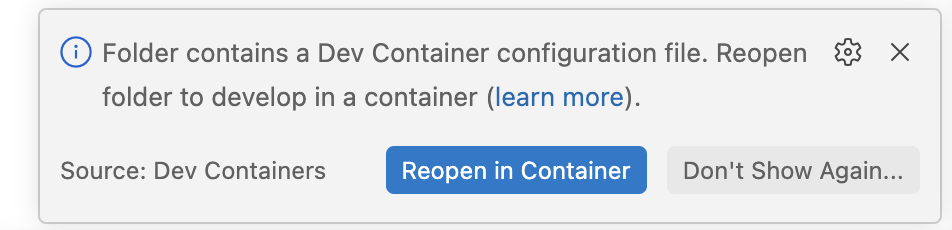

若未出现提示，可在命令面板（Command Palette）中搜索 **「Dev Containers: Reopen in Container」**。若修改过 Docker 镜像，请选择「Rebuild container」。

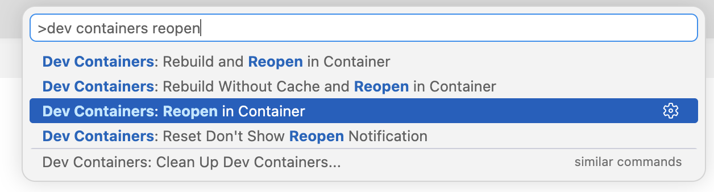

进入 Docker 容器后，可在 VS Code Terminal 中运行 torch-npu：

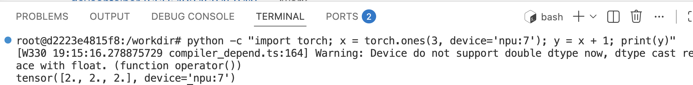

<a id="step3-enable-claude-code-extension"></a>
### 步骤 3：启用 Claude Code 扩展

搜索「Claude Code for VS Code」扩展，点击 **Install in Dev Container**（而不是在host环境上install）。

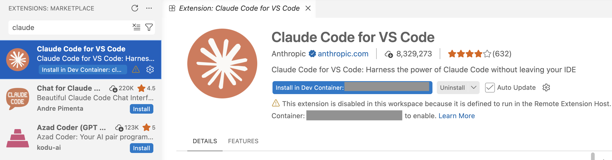

打开 Claude 聊天窗口并登录：

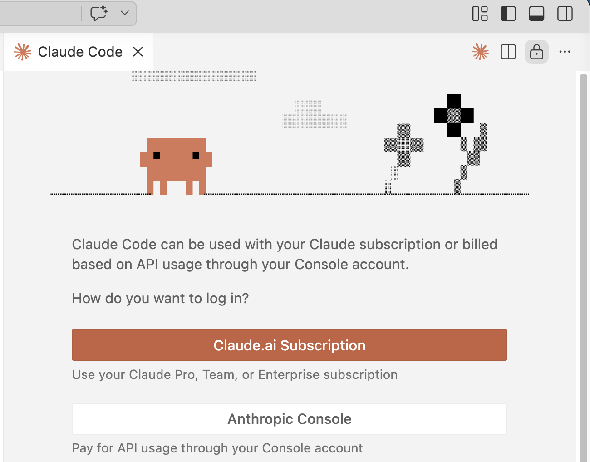

在此环境内，Claude Agent可在 NPU 执行代码。
